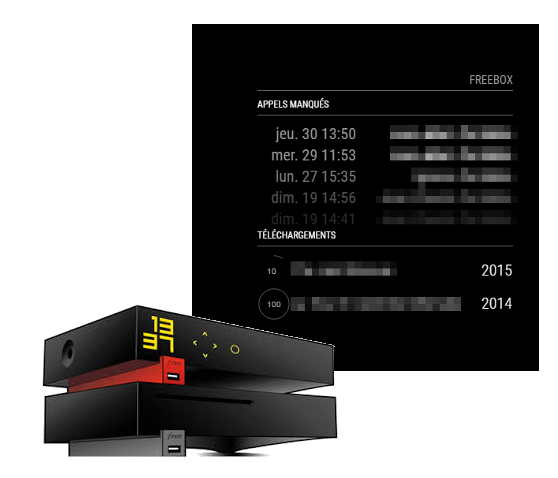

# Module: MMM-FreeBox-Monitor
The `MMM-FreeBox-Monitor` displays data from your FreeBox v6 server (Revolution) from the french ISP free. It can combine multiple data

## Using the module

To use this module, add it to the modules array in the `config/config.js` file:
````javascript
modules: [
	{
		module: 'freebox',
		position: 'top_left',	// This can be any of the regions. Best results in left or right regions.
		config: {
			mirrorName: "myMagicMirror"
			// See 'Configuration options' for more information.
		}
	}
]
````

## Configuration options

The following properties can be configured:


<table width="100%">
	<!-- why, markdown... -->
	<thead>
		<tr>
			<th>Option</th>
			<th width="100%">Description</th>
		</tr>
	<thead>
	<tbody>
		<tr>
			<td><code>maximumEntries</code></td>
			<td>The maximum number of events shown.<br>
				<br><b>Possible values:</b> <code>0</code> - <code>100</code>
				<br><b>Default value:</b> <code>10</code>
			</td>
		</tr>
		<tr>
			<td><code>maximumNumberOfDays</code></td>
			<td>The maximum number of days in the future.<br>
				<br><b>Default value:</b> <code>365</code>
			</td>
		</tr>
		<tr>
			<td><code>displaySymbol</code></td>
			<td>Display a symbol in front of an entry.<br>
				<br><b>Possible values:</b> <code>true</code> or <code>false</code>
				<br><b>Default value:</b> <code>true</code>
			</td>
		</tr>
		<tr>
			<td><code>defaultSymbol</code></td>
			<td>The default symbol.<br>
				<br><b>Possible values:</b> See <a href="http://fontawesome.io/icons/" target="_blank">Font Awsome</a> website.
				<br><b>Default value:</b> <code>calendar</code>
			</td>
		</tr>
		<tr>
			<td><code>maxTitleLength</code></td>
			<td>The maximum title length.<br>
				<br><b>Possible values:</b> <code>10</code> - <code>50</code>
				<br><b>Default value:</b> <code>25</code>
			</td>
		</tr>
		<tr>
			<td><code>fetchInterval</code></td>
			<td>How often does the content needs to be fetched? (Milliseconds)<br>
				<br><b>Possible values:</b> <code>1000</code> - <code>86400000</code>
				<br><b>Default value:</b> <code>300000</code> (5 minutes)
			</td>
		</tr>
		<tr>
			<td><code>animationSpeed</code></td>
			<td>Speed of the update animation. (Milliseconds)<br>
				<br><b>Possible values:</b><code>0</code> - <code>5000</code>
				<br><b>Default value:</b> <code>2000</code> (2 seconds)
			</td>
		</tr>
		<tr>
			<td><code>fade</code></td>
			<td>Fade the future events to black. (Gradient)<br>
				<br><b>Possible values:</b> <code>true</code> or <code>false</code>
				<br><b>Default value:</b> <code>true</code>
			</td>
		</tr>
		<tr>
			<td><code>fadePoint</code></td>
			<td>Where to start fade?<br>
				<br><b>Possible values:</b> <code>0</code> (top of the list) - <code>1</code> (bottom of list)
				<br><b>Default value:</b> <code>0.25</code>
			</td>
		</tr>
		<tr>
			<td><code>calendars</code></td>
			<td>The list of calendars.<br>
				<br><b>Possible values:</b> An array, see <i>calendar configuration</i> below.
				<br><b>Default value:</b> <i>An example calendar.</i>
			</td>
		</tr>
		<tr>
			<td><code>titleReplace</code></td>
			<td>An object of textual replacements applied to the tile of the event. This allow to remove or replace certains words in the title.<br>
				<br><b>Example:</b> <br>

				<code>
					titleReplace: {'Birthday of ' : '', 'foo':'bar'}
				</code>
			</td>
		</tr>
		<tr>
			<td><code>displayRepeatingCountTitle</code></td>
			<td>Show count title for yearly repeating events (e.g. "X. Birthday", "X. Anniversary")<br>
				<br><b>Possible values:</b> <code>true</code> or <code>false</code>
				<br><b>Default value:</b> <code>false</code>
			</td>
		</tr>
		<tr>
			<td><code>timeFormat</code></td>
			<td>Display event times as absolute dates, or relative time<br>
				<br><b>Possible values:</b> <code>absolute</code> or <code>relative</code>
				<br><b>Default value:</b> <code>relative</code>
			</td>
		</tr>
		<tr>
			<td><code>urgency</code></td>
			<td>When using a timeFormat of <code>absolute</code>, the <code>urgency</code> setting allows you to display events within a specific time frame as <code>relative</code>
			    This allows events within a certain time frame to be displayed as relative (in xx days) while others are displayed as absolute dates<br>
				<br><b>Possible values:</b> a positive integer representing the number of days for which you want a relative date, for example <code>7</code> (for 7 days)<br>
				<br><b>Default value:</b> <code>0</code> (disabled)
			</td>
		</tr>
	</tbody>
</table>

### Calendar configuration

The `calendars` property contains an array of the configured calendars.

#### Default value:
````javascript
config: {
	calendars: [
		{
			url: 'http://www.calendarlabs.com/templates/ical/US-Holidays.ics',
			symbol: 'calendar',
		},
	],
}
````


#### Calendar configuration options:
<table width="100%">
	<!-- why, markdown... -->
	<thead>
		<tr>
			<th>Option</th>
			<th width="100%">Description</th>
		</tr>
	<thead>
	<tbody>
		<tr>
			<td><code>url</code></td>
			<td>The url of the calendar .ical. This property is required.<br>
				<br><b>Possible values:</b> Any public accessble .ical calendar.
			</td>
		</tr>
		<tr>
			<td><code> symbol </code></td>
			<td>The symbol to show in front of an event. This property is optional.<br>
				<br><b>Possible values:</b> See <a href="http://fontawesome.io/icons/" target="_blank">Font Awsome</a> website.
			</td>
		</tr>
		<tr>
			<td><code> repeatingCountTitle </code></td>
			<td>The count title for yearly repating events in this calendar. <br>
				<br><b>Example:</b> <br>
				<code>'Birthday'</code>
			</td>
		</tr>
		</tbody>
</table>
